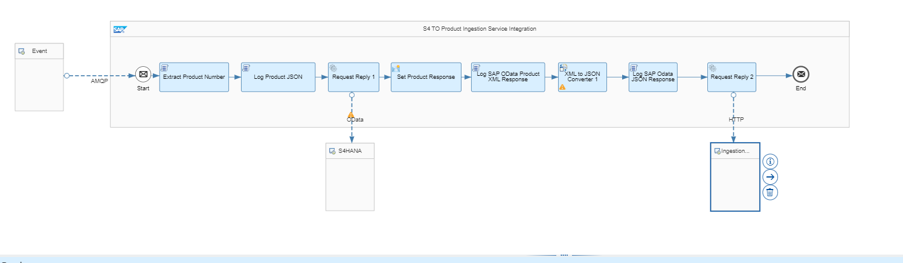

# S/4HANA Data Extractor for Product

In this particular project we have created below API consumption CDS views and used segw RDS based SADL mapping to generate the OData service out of these CDS views.

## API Consumption CDS views

1. [ZA_ProductApi](API%20CDS/Consumption%20CDS/ZA_ProductApi.txt)
2. [ZA_CustProdDesc](API%20CDS/Consumption%20CDS/ZA_CustProdDesc.txt)

These CDS view are mapped as OData entites and can be accessed for consumption.
## Publish Events

Whenever there is a new product created or changed an event will be triggered to registered S4HANA event for product as mentioned in [API Hub](https://api.sap.com/event/SAPS4HANABusinessEvents_ProductEvents/resource).

Event can be created using the [Raise Event Class](Send%20Message/ZCL_ASSIGNMENT_PRODUCT_EVENT~RAISE_EVENT.txt)

Once the message is available in queue of SAP Event Mesh this will publish message to all the subscribers.

## Use SAP Integration Suite(CPI) to pull data

Create a SAP Integration Suite(CPI) iflow to pull data from SAP S4HANA system.
This created iflow can be added as a webhook subscriber to SAP event mesh and listen to the message whenever available in queue.

Once the message is receieved this iflow will pull all the product data from S4 and replicate in destination system.

## Use ingestion service to post data to non-sap system

Use the spring boot based [ingestion service](https://github.com/mineshsapkota/assignment-ingestion) to post data to non-sap system.